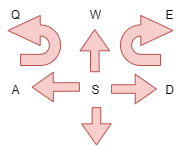

# Marvin Tele operations 

The *mrvn2_teleop*  repository contains some tele operation tools.


## m2_teleop_key_node

The node allows the user to use the keyboard also on a terminal session to steer remotely a roboter base. This node allows also the movements from an omnidirectional roboter base. 

The arrow key allow a movement in all directions and rotation. See the following diagram.




### Using with turtle Simulation

Starting the turtle simulation 

``` bash
ros2 run turtlesim turtlesim_node
```
Running the keyboard tele operations for the turtle simulation 

``` bash
ros2 run m2_teleop m2_teleop_key_node --remap /cmd_vel:=turtle1/cmd_vel
```

## ??

### Installing usb support for WSL

Setting up the USB/IP project on your Windows machine will enable common developer USB scenarios like flashing an Arduino or accessing a smartcard reader.

Support for connecting USB devices is not natively available in WSL, so you will need to install the open-source usbipd-win project.

``` powershell
winget install --interactive --exact dorssel.usbipd-win 
```

List all of the USB devices connected to Windows by opening PowerShell in administrator mode and entering the following command. Once the devices are listed, select and copy the bus ID of the device you’d like to attach to WSL.

``` powershell
usbipd list
```

Before attaching the USB device, the command usbipd bind must be used to share the device, allowing it to be attached to WSL. This requires administrator privileges. Select the bus ID of the device you would like to use in WSL and run the following command. After running the command, verify that the device is shared using the command usbipd list again.

``` powershell
usbipd bind --busid 4-4
```

To attach the USB device, run the following command. (You no longer need to use an elevated administrator prompt.) Ensure that a WSL command prompt is open in order to keep the WSL 2 lightweight VM active. Note that as long as the USB device is attached to WSL, it cannot be used by Windows. Once attached to WSL, the USB device can be used by any distribution running as WSL 2. Verify that the device is attached using usbipd list. 

``` powershell
usbipd attach --wsl --busid <busid>
```

From the WSL prompt, run lsusb to verify that the USB device is listed and can be interacted with using Linux tools.
Open Ubuntu (or your preferred WSL command line) and list the attached USB devices using the command:

``` powershell
lsusb
```

Once you are done using the device in WSL, you can either physically disconnect the USB device or run this command from PowerShell:

``` powershell
usbipd detach --busid <busid>
```


### References 

[Connect USB devices to WSL](https://learn.microsoft.com/en-us/windows/wsl/connect-usb)
